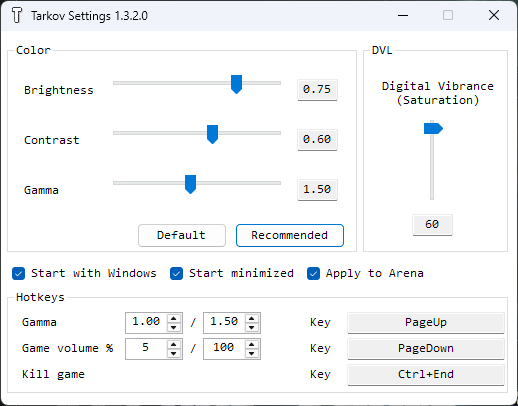

# tarkov-settings

## [->**DOWNLOAD Latest**<-](https://github.com/MongsilDev/tarkov-settings/releases/latest)

Automatically change color settings for [Escape from Tarkov](https://escapefromtarkov.com) and Arena.

Fork of [incheon-kim/tarkov-settings](https://github.com/incheon-kim/tarkov-settings) with additional features and fixes.

## What does it do?
- Brightness / Contrast / Gamma / Digital Vibrance, applied **only while the game window is focused** — no sudden flash when alt-tabbing
- Escape from Tarkov and Arena supported, Arena toggle included
- Game volume hotkey: one key toggles the game's volume between two levels (default 5% / 100%)
- Gamma hotkey: one key toggles gamma between two levels (default 1.5 / 2.0)
- Hotkeys are only active while the game is focused, so they never get in the way elsewhere
- Follows the game to whichever monitor it is on
- Run on Windows startup option
- Lives in the tray, single instance

## How it works?
- Changes Digital Vibrance value from Nvidia Settings using [NvAPIWrapper](https://github.com/falahati/NvAPIWrapper)
- Changes Gamma using [Win32 API calls](https://docs.microsoft.com/en-us/windows/win32/api/wingdi/nf-wingdi-setdevicegammaramp)

## Supported Graphic Cards
- Nvidia GPU **fully supported.** (Brightness/Contrast/Gamma/Saturation)
- AMD GPU **partially supported.** (Except Saturation)
- **Intel/Etc is not supported.**

## How to Use
1. Download the zip, right-click it > Properties > **Unblock**, then extract and run
2. Set color values with the sliders — double-click a slider label to reset it
3. Check **Apply to Arena** to use the same colors for Arena
4. In **Hotkeys**, set the two **Game volume %** levels, then click the **Key** box and press a key (default: `PageDown`). Esc cancels, Backspace clears the binding
5. Same for **Gamma** — two levels and a key (default: `PageUp`)
6. Check **Start with Windows** to launch on boot, **Start minimized** to start in the tray
7. Minimize and play

Settings are saved to `%LOCALAPPDATA%\tarkov-settings\settings.json` whenever the app closes.

## Warning
1. The screen may blink a couple of times when the game window activates. It still works.
2. **Disclaimer: I don't know if BSG will ban for using this.**
3. Only works in **Borderless mode.**
4. Windows Defender may flag the unsigned build — allow it or add an exclusion.
5. Nvidia Optimus environment (mostly laptops) is not tested.
