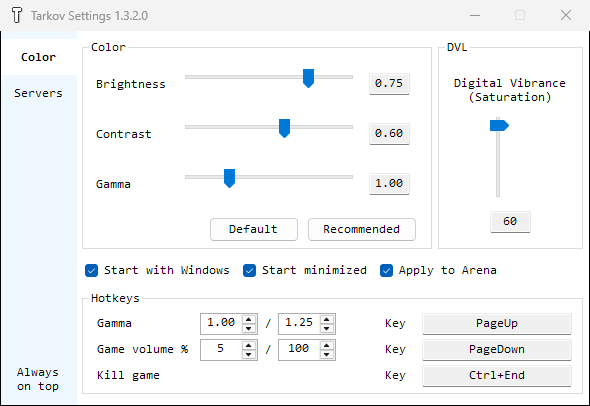

# tarkov-settings

## [->**최신 버전 다운로드**<-](https://github.com/MongsilDev/tarkov-settings/releases/latest)

Escape from Tarkov와 Arena가 포커스된 동안만 화면 색상을 바꾸는 프로그램.
[incheon-kim/tarkov-settings](https://github.com/incheon-kim/tarkov-settings) 포크에 기능과 수정을 더한 버전.

## 기능
- 밝기, 대비, 감마, Digital Vibrance를 게임 창이 포커스일 때만 적용. 알트탭하면 원래 색상
- Escape from Tarkov와 Arena 지원, Arena는 체크박스로 켜고 끔
- 핫키 3종: 감마 두 값 전환, 게임 볼륨 두 값 전환, 게임 즉시 종료. 게임 포커스 중에만 동작
- 게임 창이 있는 모니터 자동 추적
- 윈도우 시작 시 실행, 트레이 최소화 시작
- Servers 탭: 최근 72시간 레이드 목록. 시간, 맵, 지역, 서버 위치, 진입 시간(Wait), 핑. 진행 중 레이드는 LIVE 표시와 5초 간격 핑, 종료 후 게임이 기록한 평균 핑
- Always on top: 창을 항상 위에 표시

## 사용법
1. exe 다운로드 후 우클릭 > 속성 > 차단 해제, 실행
2. 슬라이더로 색상 조절. Recommended는 추천값, Default는 윈도우 기본값, 라벨 더블클릭은 항목별 기본값
3. Apply to Arena는 기본으로 켜짐. Arena를 빼려면 해제
4. Hotkeys에서 값 두 개와 키 지정. Key 칸을 클릭하고 키 입력, Esc 취소, Backspace 해제. 기본 키는 Gamma PageUp, Game volume PageDown. Kill game은 Ctrl/Alt/Shift 조합만 가능하고 지정할 때 한 번 확인
5. Start in tray는 기본으로 켜짐. 필요하면 Start with Windows 체크
6. Servers 탭은 EFT 로그 폴더를 자동 탐지. 못 찾으면 `...` 버튼으로 게임 폴더 지정
7. 왼쪽 아래 Always on top은 기본으로 켜짐. 끄려면 한 번 클릭
8. 창을 닫으면 트레이로 숨음. 완전히 끄려면 트레이 아이콘 우클릭 > Exit

설정 파일: `%LOCALAPPDATA%\tarkov-settings\settings.json`, 앱이 닫힐 때 저장.

## 주의
1. 게임 창이 활성화될 때 화면이 한두 번 깜빡일 수 있음
2. BSG가 이 프로그램 사용을 제재할지는 알 수 없음
3. Borderless 모드에서만 동작
4. GPU: NVIDIA 전체 지원, AMD는 채도 제외, Intel 미지원
5. 서명 없는 빌드라 Defender나 SmartScreen 경고가 뜨면 허용 또는 제외 등록 필요
